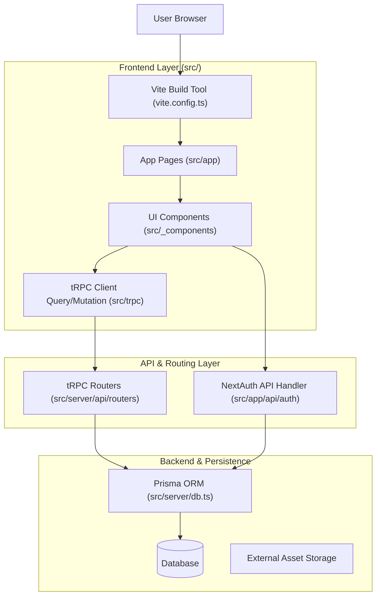

# Contributing to Datathon Webpage
🎉 Thank you for taking the time to contribute and for seeking out these instructions. Please read carefully before contributing.

## Code of Conduct
This project and everyone who participates in it is governed by our Code of Conduct. Any violation will result in a temporary suspension or a permanent ban.

## What should I know before I get started?
### Repository structure
The project leverages a full-stack T3 architecture with **Vite** as the build tool, maintaining end-to-end type safety between the client and server. Client-side routes and role-specific views reside in `src/app/`, rendered using feature modules from `src/_components/` alongside shared UI primitives. These interfaces trigger requests through the `src/trpc/` client layer, which routes actions directly to domain procedures inside `src/server/api/routers/`. Data access is driven by the Prisma ORM configured in `src/server/db.ts` and `prisma/`, connecting database queries seamlessly to backend logic, while authentication runs through specialized NextAuth endpoints in `src/app/api/`. Static assets, fonts, and seed JSON files remain in `public/` for direct web access. Vite configuration is in `vite.config.ts` at the project root.



### Setting up dependencies
It is important to install all the required dependencies and environment variables before running the project. All dependencies are listed in the `package.json` file. You can install them by using `npm install`. For the environment variables, you can refer to the `.env.example` file and create a `.env` file in the root directory of the project.

## How to contribute
### If you're external to DSC
If you're not a member of the DSC community, you can still contribute to the project by forking the repository and submitting a pull request. 
Just take into consideration the following in order to pass the review process:
- Activate `githooks` by running the python endpoint `python gitSetup.py`. 
- Fetch the latest changes from the main repository by running `git fetch upstream`.
- Make a branch according to naming conventions from post-checkout hooks.
- Open a pull request and wait until the review process is completed. You can also request a review from the maintainers of the project.

### If you're from DSC
If you're a member of the DSC community, you can contribute normally by entering the repository and creating a branch according to the naming conventions from post-checkout hooks. After making your changes, you can open a pull request and wait until the review process is completed. You can also request a review from the maintainers of the project.

### Pull requests considerations
When submitting a pull request, please ensure that your code adheres to the following guidelines:
- Follow the established coding style and conventions used in the project.
- Write a clear summary of the changes made in the pull request description, to then write a detailed description of the changes made, including any relevant context or background information. You can adhere to the following template for your pull request:

```md
# Summary
Write a sythesis of the changes made in the pull request. (No more than 100 words) (Do not use AI for this section) 

<!-- Video or image of the change -->

## Description <!-- (If changes are not significant, this section can be omitted) -->
Long detailed description of the changes made in the pull request. Include any relevant context or background information that may be helpful for reviewers to understand the changes. (Allowed to use AI for this section, but check consistency and accuracy of the information provided)

## Checklist <!-- (Optional) -->
Any checklist items that may be relevant to the pull request, such as testing, documentation, or code review requirements. (Could show on issue itself, it remains to the contributor to decide if they want to include it or not)

## State machine <!-- (Required only for functional programming routines) -->
The state machine diagram made in mermaid syntax, showing the different states and transitions of the functional programming routine.
'''mermaid
stateDiagram-v2
    [*] --> State1
    State1 --> State2
    State2 --> [*]
'''

## Useful links <!-- (Required if further reading is needed for a certain routine) -->
Documentation, explanations, or other resources that were relevant to the changes made.
```

> [!WARNING]
> If you do not follow branch naming conventions, your branch on remote will automatically be deleted after the review process is completed. Please make sure to follow the naming conventions to avoid losing your work.

> [!NOTE]
> This template can be selected directly when creating a pull request on GitHub, you don't need to copy and paste it manually. Just select the "Pull Request Template" option when creating a new pull request.

### Authorship and credit
All contributions to the project will be credited to the respective authors. This includes code contributions, documentation, and any other form of contribution. The project maintainers will ensure that all contributors are properly acknowledged and credited for their work.

> [!WARNING]
> It is considered plaigarism to copy code that is not your own and submit it as your own work. Use `git commit --author="Author Name <author@example.com>" -m "Description of the changes made."` to properly attribute the authorship of your commits. If failed to do so, as per the Code of Conduct, you will be banned from contributing to the project.

## Issues and Projects
### Issue creation
All new features, bug fixes, and improvements should be tracked through GitHub Issues and should be linked to the [datathon-webpage](https://github.com/orgs/Data-Science-Club-TEC/projects/1/views/1) project. Here you'll be able to assign issues to yourself, track progress, and collaborate with other contributors. 

Whenever creating a new issue, keep in mind the overall format and structure of the issue. This will help maintain consistency and clarity across all issues. 

> [!TIP]
> When creating an issue on GitHub, you'll be prompted to select a template. Not only does this facilitates the process of creating an issue, but also ensures proper linking to the project board.

With this, we can ensure that all issues are properly tracked and managed, making it easier for contributors to stay organized and focused on their work.

### Sprint system
The project follows a sprint system, where each sprint lasts for three weeks. During this time, active contributors are expected to have solved at least one issue or at the very least, have made significant progress on one. Ensuring that all contributors are actively engaged and making meaningful contributions to the project.

> [!NOTE]
> Sprints update every three weeks; equating 5 sprints per semester. Offseason sprints are also available for contributors who wish to continue contributing during winter & summer breaks.

### Project board
The project board is a visual representation of the project's progress and is used to track the status of issues and pull requests. It is divided into columns that represent different stages of the development process, such as "To Do", "In Progress", and "Done". 

> [!NOTE]
> Currently, project boards are only available for members of the DSC community. Expect this feature to be available for external contributors in the future.